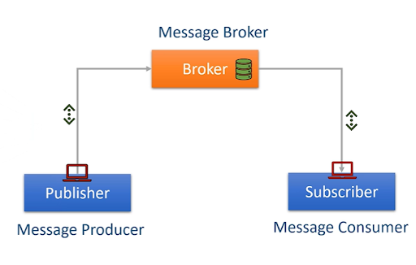

### How Apache Kafka Works?

-   **Publisher (Message Producer):**
    
    -   Publisher represents an application or system that **sends** messages.
    -   The publisher sends messages to the broker.
    -   It creates messages (e.g., events, logs, or data) and publishes them to a specific topic in the broker.
-   **Broker (Message Broker):**
    
    -   This is the central component of the messaging system. It acts as an intermediary that **receives messages from publishers and makes them available to subscribers.**
    -   In Kafka, this would be a **Kafka Broker**. A Kafka cluster would consist of multiple such brokers.
    -   The database icon within the Broker box visually suggests that the broker is responsible for storing the messages. In Kafka's case, messages are persisted on disk.
-   **Subscriber (Message Consumer):**
    
    -   **Subscriber** represents an application or system that **receives** or "subscribes" to messages.
    -   Also referred to as the **Message Consumer**, it subscribes to a specific topic to receive messages published to that topic.
    -   The subscriber retrieves messages from the broker.
    -   Subscribers can receive multiple messages over time.
 
---

### Message Flow
1. **Publishing Messages**:
   - The **Publisher** generates a message (e.g., a log entry, sensor data, or event) and sends it to the **Broker**.
   - In Kafka, this message is sent to a specific **topic**. A topic is like a category or channel that organizes messages (e.g., `test-topic` in your Python examples).
   - The broker stores the message in its log, ensuring it’s available for consumers.

2. **Storing Messages**:
   - The **Broker** (Kafka) stores the message in a durable, fault-tolerant manner using its log system (represented by the green cylinder).
   - Kafka organizes messages into topics, which are further divided into **partitions** for scalability and parallelism. Messages are retained for a configurable period (e.g., 7 days by default) or until a size limit is reached.

3. **Consuming Messages**:
   - The **Subscriber** (or Message Consumer) connects to the broker and subscribes to the relevant topic.
   - The broker delivers messages from the topic to the subscriber. In Kafka, consumers can read messages at their own pace, and Kafka tracks their progress using **offsets** (a pointer to the last message they read).
   - Consumers can belong to a **consumer group**, allowing multiple consumers to process messages in parallel for load balancing.
